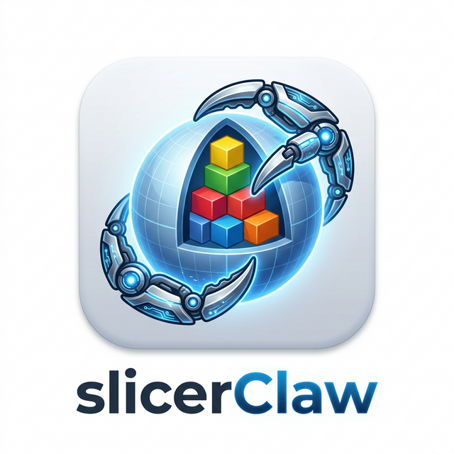

<p align="center">
  
</p>

# SlicerClaw (Slicer Native AI Agent & MCP Server)

English | [简体中文](README_zh-CN.md)

A revolutionary, lightning-fast AI assistant natively integrated into 3D Slicer.
SlicerClaw provides a seamless, "Spotlight"-style floating command bar for native control, while simultaneously running a secure **Model Context Protocol (MCP)** server on port 2016 to allow external AI tools (like Cursor, Claude Desktop, OpenCode) to control your 3D Slicer environment.

## Features

- **Spotlight Interface:** No more clunky, docked panels. Just press `Ctrl+I` (Cmd+I) from anywhere in Slicer to summon a beautiful, translucent floating bar.
- **Embedded MCP Server:** Safely exposes Slicer's Python environment to external AIs via standard JSON-RPC HTTP requests on `http://127.0.0.1:2016/mcp`.
- **Function Calling (Tools):** Both native and external AI have direct access to Slicer's Python environment. They can list nodes, get properties, take screenshots, and execute arbitrary python code natively.
- **One-Click MCP Bridge Generator:** Easily generate a `slicer_mcp_bridge.py` script from the UI to seamlessly connect stdio-based AI clients (like Claude/Cursor).
- **Built-in Knowledge Base Downloader:** Directly download and extract Slicer AI Skills (e.g., `jumbojing/slicerSkill`, Slicer Source Code, Discourse Archives) from the UI to empower your models with 3D Slicer's specific coding context.
- **Auto Skill Discovery:** The internal MCP tools will automatically search your downloaded skills so external AIs don't have to manually mount the folders.

## Installation

1. Clone or download this repository to your local machine:
   ```bash
   git clone https://github.com/YourUsername/SlicerClaw.git
   ```
2. Open 3D Slicer.
3. Go to **Edit -> Application Settings -> Modules**.
4. Add the `slicerClaw` directory to your Additional Module Paths.
5. Restart 3D Slicer.

## Usage

### 1. Native Spotlight Chat Setup
Opening the **SlicerClaw** module from the modules menu reveals 3 main panels. In the first panel, enter your `API Base URL` and `API Key` (e.g., OpenAI or Aliyun Bailian).
Press **`Ctrl+I`** anywhere in Slicer to summon the Copilot, type your request, and the AI will execute it in the background!

### 2. External AI Connection (MCP)
If you prefer using Cursor, OpenCode, or Claude Desktop to control Slicer:
1. Open the SlicerClaw module and expand **"2. External AI Connection (Cursor/Claude)"**.
2. Click **Generate Local slicer_mcp_bridge.py** and save the script to your computer.
3. In your external AI MCP settings, add a new server. Set the type to `command`/`stdio`, use `python` as the command, and provide the absolute path to your generated bridge script as the argument.

### 3. Downloading Slicer Skills (Knowledge Base)
To prevent your AI from hallucinating incorrect Slicer Python APIs:
1. Open the SlicerClaw module and expand **"3. AI Knowledge Base (Skills & Data)"**.
2. Select your desired skill source (e.g., `jumbojing/slicerSkill` or Local Data).
3. Click **Download & Extract** and point it to your working environment (e.g., `.opencode/skills`).
4. SlicerClaw's MCP server will now automatically search these files when the AI requests Slicer programming knowledge!

*Note: The local skill capability and MCP connection concepts take deep inspiration from the pioneering work at [pieper/slicer-skill](https://github.com/pieper/slicer-skill).*

## ⚠️ Important Security Warning

**Use extreme caution when running the MCP Server and exposing it to external AI tools.**

The SlicerClaw MCP server grants any connected MCP client the ability to **execute arbitrary Python code** inside your Slicer process. This is powerful but carries significant risk:

* **Code execution:** A compromised or hallucinating AI client can run any code with the full privileges of the Slicer process, including reading and writing files (e.g., `os.remove()`), accessing the network, and modifying your system.
* **Protected Health Information (PHI):** If you are working with patient data or other confidential medical imaging information, be aware that an MCP client (and the remote AI model behind it) may send and receive data that includes PHI. Ensure you comply with your institution's data-handling policies, HIPAA, and any other applicable regulations.
* **Third-party models:** Prompts, screenshot tool responses, and scene data may be transmitted to cloud-hosted AI services (e.g., OpenAI, Claude, DeepSeek). Do not assume that data shared through the MCP connection stays local unless you use a local model.
* **Network Exposure:** Never expose port `2016` to the public internet or untrusted networks. SlicerClaw is designed strictly for local development environments (`127.0.0.1`).

**Recommendation:** We strongly recommend running Slicer and the MCP server inside a contained environment (like Docker or Virtual Machines) when testing untrusted agents, limiting the blast radius of any unintended actions and reducing the chance of exposing sensitive data.

## 🚀 Future Roadmap & TODOs

SlicerClaw is evolving fast! Here is what we plan to tackle next:
- [ ] **Sandboxed Execution:** Improve the security of the `execute_python` tool by restricting filesystem access and dangerous imports.
- [ ] **Multi-Modal AI Support:** Allow external Vision Language Models (like Claude 3.5 Sonnet or GPT-4o) to directly "see" the `screenshot` tool output inside the native Spotlight chat, not just via external MCP.
- [ ] **Context Window Optimization:** The built-in `search_slicer_knowledge` currently dumps potentially large chunks of markdown. We want to implement local vector embeddings (RAG) within Slicer to provide surgically precise AI context.
- [ ] **Task Automation Macros:** Record a series of AI actions and convert them into reusable Python macros that the user can execute later with a single click.
- [ ] **Auto-Correct Loops:** If the AI executes a python script that throws a Slicer Exception, feed the traceback automatically back into the LLM to self-heal its code.
- [ ] **Long-Term Memory:** Equip the AI with persistent memory across Slicer sessions so it remembers your workflow preferences, past mistakes, and project-specific contexts.
- [ ] **Self-Learning & Evolution:** Enable the AI to autonomously write new skills, generate documentation from its own successes, and save them back into the local Knowledge Base to continuously evolve its proficiency.

## 🔗 Related Projects

SlicerClaw builds upon and is inspired by a thriving ecosystem of AI integration within 3D Slicer. We highly recommend checking out these related projects:

* **[pieper/slicer-skill](https://github.com/pieper/slicer-skill)** — The foundational Claude skill for 3D Slicer that pioneered the MCP integration and local documentation indexing workflow. *SlicerClaw's MCP architecture and Skill download mechanics are directly inspired by this repository.*
* **[jumbojing/slicerSkill](https://github.com/jumbojing/slicerSkill)** — The comprehensive, cloud-searchable core AI skill fork used as the default knowledge base in SlicerClaw.
* **[mcp-slicer](https://github.com/zhaoyouj/mcp-slicer)** — A standalone MCP server for 3D Slicer by @zhaoyouj, installable via `pip`. It uses Slicer's built-in WebServer API as a bridge.
* **[SlicerDeveloperAgent](https://github.com/muratmaga/SlicerDeveloperAgent)** — A Slicer extension by Murat Maga that embeds an AI coding agent directly inside 3D Slicer using Gemini.
* **[SlicerChat: Building a Local Chatbot for 3D Slicer](https://arxiv.org/abs/2407.11987)** (Barr, 2024) — Explores integrating a locally-run LLM (Code-Llama Instruct) into 3D Slicer to assist users, investigating the effects of domain knowledge on answer quality.
